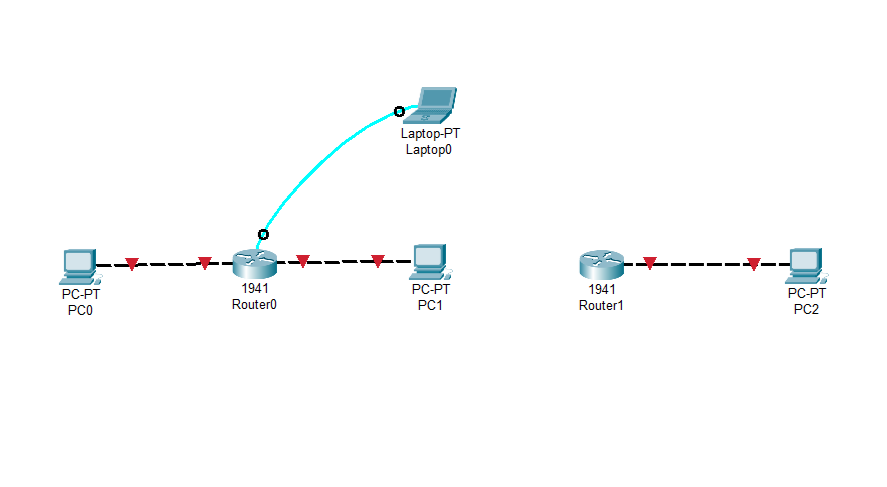

* **Check IP Configuration**
    * ```
      ipconfig
      ```
    * ```
      ipconfig /all
      ```

* **Ping domain or IP**
    * ```
      ping google.com
      ```

* **Trace route to domain or IP**
    * ```
      tracert 1.1.1.1
      ```

* **Check DNS**
    * ```
      nslookup google.com
      ```
    * ```
      nslookup
        > 1.1.1.1
      ```
---

<br>
