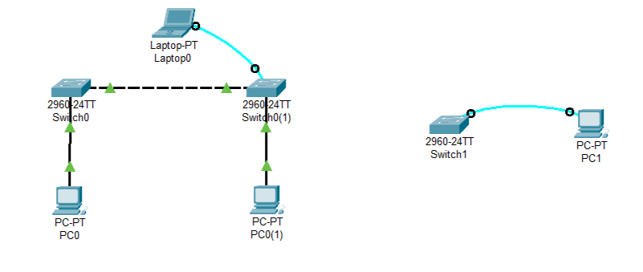

* **Cisco IOS Modes of Operation**  
   1. `Hostname>`  - User EXEC Mode (`enable` to enter Privileged EXEC Mode)
   2. `Hostname#`  - Privileged EXEC Mode (`configure terminal` to enter Global Configuration Mode)
   3. `Hostname(config)#`  - Global Configuration Mode

* **Setting the Time and Date**  
   1. `Hostname> enable`  
   2. `Hostname# clock set 15:30:00 24 February 2024`  
   3. `Hostname# show clock`  

* **Setting up a Switch**
   1. `Switch> enable`  - Enter Privileged EXEC Mode  
   2. `Switch#  show running-config`  - Show the current configuration
   3. `Switch# configure terminal`  - Enter Global Configuration Mode
   4. `Switch(config)# hostname S1`  - Set the hostname to S1
   5. `S1(config)# line console 0`  - Enter Console Line Configuration Mode
   6. `S1(config-line)# password letmein`  - Set the console password
   7. `S1(config-line)# login`  - Enable login on the console
   8. `S1(config-line)# exit`  
   9. `S1(config)# enable password c1$c0`  - Set the privileged exec password(plaintext)
   10. `S1(config)# enable secret c1$c0`  - Set the encrypted privileged exec password(encrypted)
   11. `S1(config)# service password-encryption`   - Encrypt all passwords(plaintext to encrypted)
   12. `S1(config)# banner motd "Authorized Access Only!"`  - Set the message of the day banner
   13. `S1(config)# copy running-config startup-config`  - Save the configuration to NVRAM(Non-Volatile RAM)

* **IP Classes**  
   * **Class A** - 1-126
   * **Class B** - 128-191
   * **Class C** - 192-223
   * **Class D** - 224-239
   * **Class E** - 240-255
   * Fist IP is Default Gateway & Last IP is Broadcast Address
 
 * Subnet - Breaks down a network into smaller networks
 * Subnet Mask - Determines the network and host portions of an IP address     

---

 
