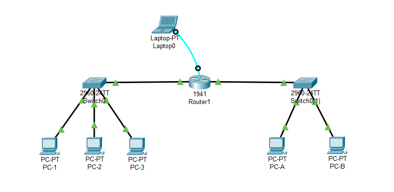

### **Assigning IP Address to a Router**
    1. `Router> enable`  
    2. `Router# configure terminal`
    3. `Router(config)# interface gigabitethernet 0/0/0`  - Enter Interface Configuration Mode
    4. `Router(config-if)# ip address 192.168.1.2 255.255.255.0`
    5. `Router(config-if)# no shutdown`  - Enable the interface
    6. `Router(config-if)# end`  - Exit to Privileged EXEC Mode
    7. `Router# copy running-config startup-config`
    8. `Router# show ip interface brief`  - Verify the configuration
    9. `Router# exit`

 

### **Assigning Default Gateway to a Switch**
    1. `S1> enable`  
    2. `S1# configure terminal`
    3. `S1(config)# ip default-gateway 192.168.1.2`
    4. `S1(config)# exit`
    5. `S1# copy running-config startup-config`

 

---

### **Addressing Table**

| **Device** | **Interface** | **IP Address** | **Subnet Mask** | **Default Gateway** |
| ---------- | ------------- | -------------- | --------------- | ------------------- |
| R          | Gi 0/0        | 192.168.1.1    | 255.255.255.0   | ---                 |
| R          | Gi 0/1        | 172.16.5.1     | 255.255.0.0     | ---                 |
| S1         | Vlan 1        | 192.168.1.2    | 255.255.255.0   | 192.168.1.1         |
| S2         | Vlan 1        | 172.16.5.2     | 255.255.0.0     | 172.16.5.1          |
| PC-A       | NIC           | 172.16.5.3     | 255.255.0.0     | 172.16.5.1          |
| PC-B       | NIC           | 172.16.5.4     | 255.255.0.0     | 172.16.5.1          |
| PC1        | NIC           | 192.168.1.3    | 255.255.255.0   | 192.168.1.1         |
| PC2        | NIC           | 192.168.1.4    | 255.255.255.0   | 192.168.1.1         |
| PC2        | NIC           | 192.168.1.5    | 255.255.255.0   | 192.168.1.1         |

 