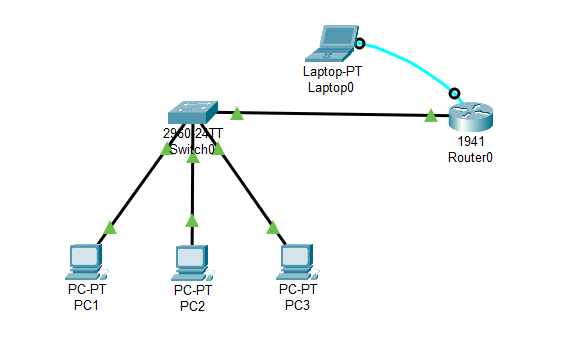
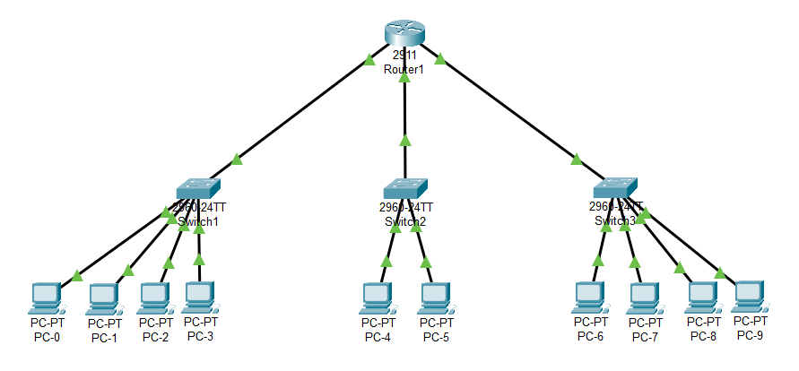

### **Configuring DHCP Server on Cisco Router** 
  1. `Router> enable`
  2. `Router# configure terminal`
  3. `Router(config)# interface gigabitEthernet 0/0`  - Enter Interface Configuration Mode
  4. `Router(config-if)# ip address 192.168.1.1 255.255.255.0`
  5. `Router(config-if)# description <any_description>`
  6. `Router(config-if)# no shutdown`
  7. `Router(config-if)# exit`
  8. `Router(config)# service dhcp`  - Enable DHCP Service
  9. `Router(config)# ip dhcp pool <pool_name>`  - Create a DHCP Pool
  10. `Router(dhcp-config)# network 192.168.1.0 255.255.255.0`  - Define the Network Address and Subnet Mask
  11. `Router(dhcp-config)# default-router 192.168.1.1`  - Define the Default Gateway
  12. `Router(dhcp-config)# dns-server 8.8.8.8`  - Define the DNS Server
  13. `Router(dhcp-config)# exit`
  14. `Router(config)# ip dhcp excluded-address 192.168.1.1 192.168.1.2`  - Exclude IP Addresses from the DHCP Pool
  15. `Router(config)# end`
  16. `Router# copy running-config startup-config`
  17. `Router# exit`

---

<strong>Addressing Table (Home Activity)</strong>

| **Device** | **Interface** | **IP Address** | **Subnet Mask** | **Default Gateway** |
| ---------- | ------------- | -------------- | --------------- | ------------------- |
| R          | Gi 0/0        | 192.168.1.1    | 255.255.255.0   | ---                 |
| R          | Gi 0/1        | 172.16.5.1     | 255.255.0.0     | ---                 |
| R          | Gi 0/2        | 10.0.0.1       | 255.0.0.0       | ---                 |
| S1         | Vlan 1        | 192.168.1.2    | 255.255.255.0   | 192.168.1.1         |
| S2         | Vlan 1        | 172.16.5.2     | 255.255.0.0     | 172.16.5.1          |
| S3         | Vlan 1        | 10.0.0.2       | 255.0.0.0       | 10.0.0.1            |

<strong>Screenshot</strong>

 

