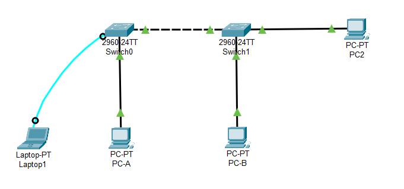
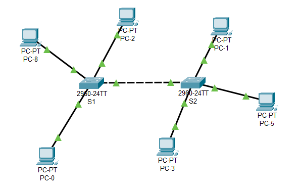

### **Creating a VLAN & Assigning Ports**
 1. `Switch> enable`
 2. `Switch# configure terminal`
 3. `Switch(config)# vlan 10`  - Create VLAN 10
 4. `Switch(config-vlan)# name <vlan_name>`  - Assign a Name to the VLAN
 5. `Switch(config-vlan)# exit`
 6. `Switch(config)# interface range fastEthernet 0/1-5`  - Enter Interface Range Configuration Mode
 7. `Switch(config-if-range)# switchport mode access`  - Set the Interface Mode to Access
 8. `Switch(config-if-range)# switchport access vlan 10`  - Assign the Interface to VLAN 10
 9. `Switch(config-if-range)# exit`
 10. `Switch(config)# end`
 11. `Switch# show vlan brief`  - Verify the VLAN Configuration

### **Assigning IP Address to VLAN Interface**
 1. `Switch> enable`
 2. `Switch# configure terminal`
 3. `Switch(config)# interface vlan 10`  - Enter Interface Configuration Mode
 4. `Switch(config-if)# ip address 192.168.1.1 255.255.255.0`
 5. `Switch(config-if)# no shutdown`
 6. `Switch(config-if)# exit`

### **Removing VLAN & Ports**
 1. `Switch> enable`
 2. `Switch# configure terminal`
 3. `Switch(config)# no vlan 10`  - Remove VLAN 10
 4. `Switch(config)# interface range fastEthernet 0/1-5`  - Enter Interface Range Configuration Mode
 5. `Switch(config-if-range)# no switchport access vlan 10`  - Remove the Interface from VLAN 10
 6. `Switch(config-if-range)# exit`

### **Configuring Trunk** 
  1. `Switch> enable`
  2. `Switch# configure terminal`
  3. `Switch(config)# interface gigabitEthernet 0/1`  - Enter Interface Configuration Mode
  4. `Switch(config-if)# switchport mode dynamic desirable`  - Set the Interface Mode to Dynamic Desirable (use `trunk` to manually configure)
  5. `Switch(config-if)# exit`
  6. `Switch(config)# end`
  7. `Switch# show interfaces trunk`  - Verify the Trunk Configuration

---

<strong>Screenshot</strong>

 

