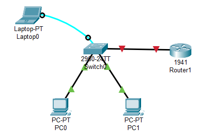
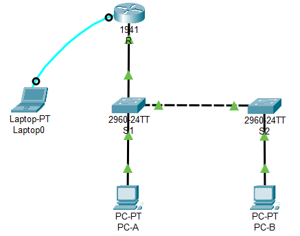

### **Securing Ports**
  1. `Switch> enable`
  2. `Switch# configure terminal`
  3. `Switch(config)# interface f0/1`
  4. `Switch(config-if)# switchport mode access`
  5. `Switch(config-if)# switchport port-security`
  6. `Switch(config-if)# switchport port-security maximum 1`  - Set the Maximum Number of MAC Addresses
  7. `Switch(config-if)# switchport port-security mac-address sticky` - Learn MAC Addresses Dynamically
  8. `Switch(config-if)# switchport port-security violation shutdown` - Action to Take When Violation Occurs
  9. `Switch# show port-security interface f0/1` - Verify Port Security

  ### **Creating subinterfaces on Router**
  1. `Router> enable`
  2. `Router# configure terminal`
  3. `Router(config)# interface f0/0.1` - Create Subinterface named f0/0.1
  4. `Router(config-subif)# encapsulation dot1Q 10` - Assign VLAN ID
  5. `Router(config-subif)# ip address 192.168.1.1 255.255.255.0`
  6. `Router(config-subif)# exit`

  ### **Creating VLANs and Trunking**
  1. `Switch> enable`
  2. `Switch# configure terminal`
  3. `Switch(config)# vlan 10`
  4. `Switch(config-vlan)# name Students`
  5. `Switch(config)# interface f0/1`
  6. `Switch(config-if)# switchport mode trunk`
  7. `Switch(config-if)# switchport trunk allowed vlan 10`

  ### **Configuring Access Mode**
  1. `Switch> enable`
  2. `Switch# configure terminal`
  3. `Switch(config)# interface f0/1` - Interface connected to Router
  4. `Switch(config-if)# switchport mode access`
  5. `Switch(config-if)# switchport access vlan 10`

---

<strong>Addressing Table</strong>

| Device | Interface | IP Address   | Subnet Mask    | Default Gateway |
|--------|-----------|--------------|----------------|-----------------|
| R      | G0/0.1    | 192.168.1.1  | 255.255.255.0  |                 |
| R      | G0/0.10   | 192.168.10.1 | 255.255.255.0  |                 |
| R      | G0/0.20   | 192.168.20.1 | 255.255.255.0  |                 |
| S1     | VLAN 1    | 192.168.1.11 | 255.255.255.0  | 192.168.1.1     |
| S1     | VLAN 10   | 192.168.10.2 | 255.255.255.0  |                 |
| S2     | VLAN 1    | 192.168.1.12 | 255.255.255.0  | 192.168.1.1     |
| S2     | VLAN 20   | 192.168.20.2 | 255.255.255.0  |                 |
| PC-A   | NIC       | 192.168.10.3 | 255.255.255.0  | 192.168.10.1    |
| PC-B   | NIC       | 192.168.20.3 | 255.255.255.0  | 192.168.20.1    |

<strong>Screenshot</strong>

 

