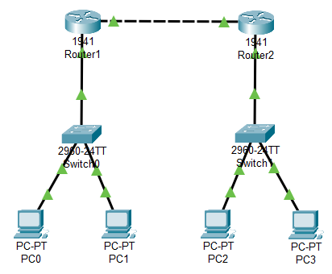
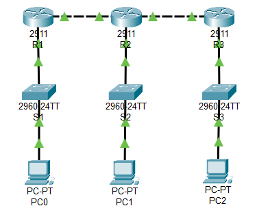

### **Dynamic Routing with RIP**
  1. `Router> enable`
  2. `Router# configure terminal`
  3. `Router(config)# router rip`
  4. `Router(config-router)# network 192.168.1.0` - Network IP of networks connected to the router
  5. `Router(config-router)# exit`

---

<strong>Addressing Table (L8_A)</strong>

| Device | Interface | IP Address   | Subnet Mask    | Default Gateway |
|--------|-----------|--------------|----------------|-----------------|
| R1     | G0/1      | 192.168.0.1  | 255.255.255.252|                 |
| R1     | G0/0      | 192.168.1.1  | 255.255.255.0  |                 |
| R2     | G0/1      | 192.168.0.2  | 255.255.255.252|                 |
| R2     | G0/0      | 192.168.2.1  | 255.255.255.0  |                 |
| S1     | VLAN 1    | 192.168.1.2  | 255.255.255.0  | 192.168.1.1     |
| S2     | VLAN 1    | 192.168.2.2  | 255.255.255.0  | 192.168.2.1     |
| PC-A   | NIC       | 192.168.1.3  | 255.255.255.0  | 192.168.1.1     |
| PC-B   | NIC       | 192.168.1.4  | 255.255.255.0  | 192.168.1.1     |
| PC-1   | NIC       | 192.168.2.3  | 255.255.255.0  | 192.168.2.1     |
| PC-2   | NIC       | 192.168.2.4  | 255.255.255.0  | 192.168.2.1     |

<strong>Addressing Table (L8_B)</strong>

| Device | Interface | IP Address   | Subnet Mask    | Default Gateway |
|--------|-----------|--------------|----------------|-----------------|
| R1     | G0/1      | 192.168.1.1  | 255.255.255.0  |                 |
| R1     | G0/0      | 192.168.2.1  | 255.255.255.252|                 |
| R2     | G0/2      | 192.168.3.1  | 255.255.255.252|                 |
| R2     | G0/1      | 192.168.0.1  | 255.255.255.0  |                 |
| R2     | G0/0      | 192.168.2.2  | 255.255.255.252|                 |
| R3     | G0/0      | 192.168.3.2  | 255.255.255.252|                 |
| R3     | G0/1      | 192.168.4.1  | 255.255.255.0  |                 |
| S1     | VLAN 1    | 192.168.1.2  | 255.255.255.0  | 192.168.1.1     |
| S2     | VLAN 1    | 192.168.0.2  | 255.255.255.0  | 192.168.0.1     |
| S3     | VLAN 1    | 192.168.4.2  | 255.255.255.0  | 192.168.4.1     |
| PC-1   | NIC       | 192.168.1.3  | 255.255.255.0  | 192.168.1.1     |
| PC-2   | NIC       | 192.168.0.3  | 255.255.255.0  | 192.168.0.1     |
| PC-3   | NIC       | 192.168.4.3  | 255.255.255.0  | 192.168.4.1     |

<strong>Screenshot</strong>

 

