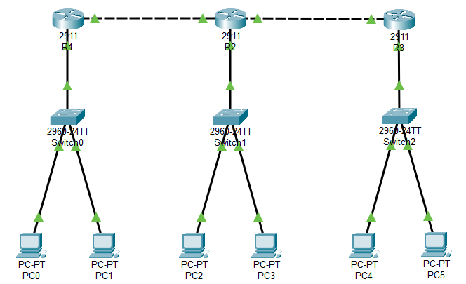

### **Dynamic Routing with EIGRP**
  1. `Router> enable`
  2. `Router# configure terminal`
  3. `Router(config)# router eigrp 1` - Start EIGRP process with process ID 1
  4. `Router(config-router)# network 192.168.1.0 0.0.0.255 area 0` - Network IP with wildcard mask and area ID

---

<strong>Addressing Table</strong>

| Device | Interface | IP Address   | Subnet Mask    | Default Gateway |
|--------|-----------|--------------|----------------|-----------------|
| R1     | G0/0      | 192.168.0.1  | 255.255.255.252|                 |
| R1     | G0/1      | 192.168.1.1  | 255.255.255.0  |                 |
| R2     | G0/0      | 192.168.0.2  | 255.255.255.252|                 |
| R2     | G0/1      | 192.168.2.1  | 255.255.255.192|                 |
| R2     | G0/2      | 192.168.0.5  | 255.255.255.252|                 |
| R3     | G0/1      | 192.168.3.1  | 255.255.255.224|                 |
| R3     | G0/2      | 192.168.0.6  | 255.255.255.252|                 |
| PC-0   | NIC       | 192.168.1.2  | 255.255.255.0  | 192.168.1.1     |
| PC-1   | NIC       | 192.168.1.3  | 255.255.255.0  | 192.168.1.1     |
| PC-2   | NIC       | 192.168.2.2  | 255.255.255.192| 192.168.2.1     |
| PC-3   | NIC       | 192.168.2.3  | 255.255.255.192| 192.168.2.1     |
| PC-4   | NIC       | 192.168.3.2  | 255.255.255.224| 192.168.3.1     |
| PC-5   | NIC       | 192.168.3.3  | 255.255.255.224| 192.168.3.1     |

<strong>Screenshot</strong>

 

