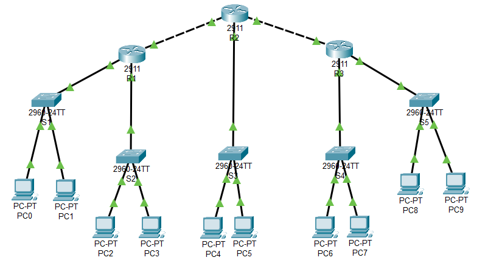

### **Configuring ACL on Router**
  1. `Router(config)# access-list 1 remark Allow Network A to access Network B`
  2. `Router(config)# access-list 1 permit 192.168.1.0 0.0.0.255`
  3. `Router(config)# access-list 1 deny any`

### **Assigning ACL to Interface**
  1. `Router(config)# interface g0/0`
  2. `Router(config-if)# ip access-group 1 out`

---

<strong>Addressing Table</strong>

| Device | Interface | IP Address   | Subnet Mask    | Default Gateway |
|--------|-----------|--------------|----------------|-----------------|
| R1     | G0/0      | 192.168.2.1  | 255.255.255.0  |                 |
| R1     | G0/1      | 192.168.1.1  | 255.255.255.0  |                 |
| R1     | G0/2      | 192.168.6.1  | 255.255.255.252|                 |
| R2     | G0/0      | 192.168.7.1  | 255.255.255.252|                 |
| R2     | G0/1      | 192.168.3.1  | 255.255.255.0  |                 |
| R2     | G0/2      | 192.168.6.2  | 255.255.255.252|                 |
| R2     | G0/2      | 192.168.7.2  | 255.255.255.252|                 |
| R3     | G0/1      | 192.168.4.1  | 255.255.255.0  |                 |
| R3     | G0/2      | 192.168.5.1  | 255.255.255.0  |                 |
| S1     | VLAN 1    | 192.168.1.2  | 255.255.255.0  | 192.168.1.1     |
| S2     | VLAN 1    | 192.168.2.2  | 255.255.255.0  | 192.168.2.1     |
| S3     | VLAN 1    | 192.168.3.2  | 255.255.255.0  | 192.168.3.1     |
| S4     | VLAN 1    | 192.168.4.2  | 255.255.255.0  | 192.168.4.1     |
| S5     | VLAN 1    | 192.168.5.2  | 255.255.255.0  | 192.168.5.1     |
| PC-0   | NIC       | 192.168.1.3  | 255.255.255.0  | 192.168.1.1     |
| PC-1   | NIC       | 192.168.1.4  | 255.255.255.0  | 192.168.1.1     |
| PC-2   | NIC       | 192.168.2.3  | 255.255.255.0  | 192.168.2.1     |
| PC-3   | NIC       | 192.168.2.4  | 255.255.255.0  | 192.168.2.1     |
| PC-4   | NIC       | 192.168.3.3  | 255.255.255.0  | 192.168.3.1     |
| PC-5   | NIC       | 192.168.3.4  | 255.255.255.0  | 192.168.3.1     |
| PC-6   | NIC       | 192.168.4.3  | 255.255.255.0  | 192.168.4.1     |
| PC-7   | NIC       | 192.168.4.4  | 255.255.255.0  | 192.168.4.1     |
| PC-8   | NIC       | 192.168.5.3  | 255.255.255.0  | 192.168.5.1     |
| PC-9   | NIC       | 192.168.5.4  | 255.255.255.0  | 192.168.5.1     |

<strong>Screenshot</strong>

 

