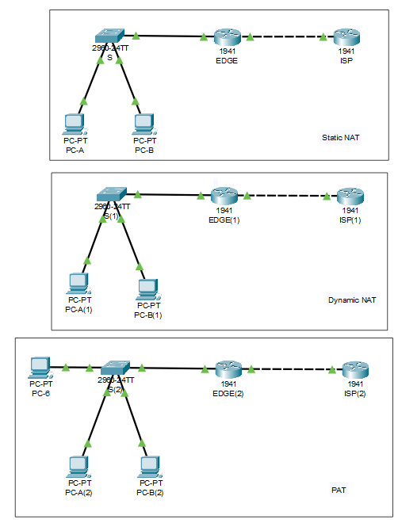

### **Configuring Static NAT**
  1. `Router(config)# ip route 0.0.0.0 0.0.0.0 11.11.11.1`
  2. `Router(config)# ip nat inside source static 192.168.1.2 11.11.11.3`
  3. `Router(config)# interface g0/0`
  4. `Router(config-if)# ip nat inside`
  5. `Router(config)# interface g0/1`
  6. `Router(config-if)# ip nat outside`

### **Configuring Dynamic NAT**
  1. `Router(config)# ip route  0.0.0.0 0.0.0.0 11.11.11.1`
  2. `Router(config)# access-list 1 permit 192.168.1.0 0.0.0.255`
  3. `Router(config)# ip nat pool public_access 11.11.11.3 11.11.11.6 netmask 255.255.255.248`
  4. `Router(config)# ip nat inside source list 1 pool public_access`
  5. `Router(config)# interface g0/0`
  6. `Router(config-if)# ip nat inside`
  7. `Router(config)# interface g0/1`
  8. `Router(config-if)# ip nat outside` 

### **Configuring PAT**
  1. `Router(config)# ip route 0.0.0.0 0.0.0.0 11.11.11.1`
  2. `Router(config)# access-list 1 permit 192.168.1.0 0.0.0.255`
  3. `Router(config)# ip nat inside source list 1 interface g0/1 overload`
  4. `Router(config)# interface g0/0`
  5. `Router(config-if)# ip nat inside`
  6. `Router(config)# interface g0/1`
  7. `Router(config-if)# ip nat outside`

---

<strong>Addressing Table</strong>

| Device | Interface | IP Address   | Subnet Mask    | Default Gateway |
|--------|-----------|--------------|----------------|-----------------|
| Edge   | G0/1      | 192.168.1.1  | 255.255.255.0  |                 |
| Edge   | G0/0      | 11.11.11.2   | 255.255.255.248|                 |
| ISP    | G0/0      | 11.11.11.1   | 255.255.255.248|                 |
| ISP    | G0/1      | 192.168.2.1  | 255.255.255.0  |                 |
| PC-A   | NIC       | 192.168.1.2  | 255.255.255.0  | 192.168.1.1     |    
| PC-B   | NIC       | 192.168.1.3  | 255.255.255.0  | 192.168.1.1     |  
| PC-6   | NIC       | 192.168.1.3  | 255.255.255.0  | 192.168.1.1     |  

<strong>Screenshot</strong>

 

